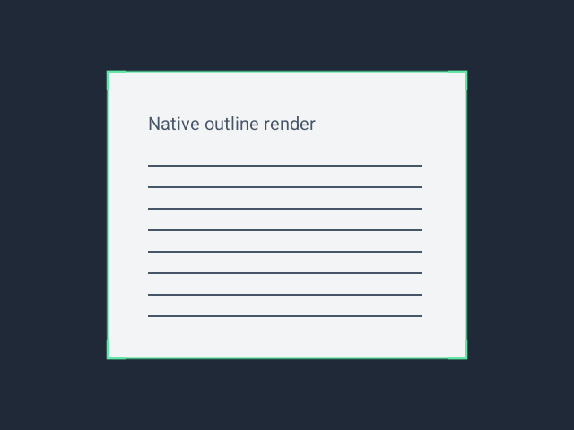

# Live edge refinement — Android 1.1.1 (4)

The update follows the Pixel 8 user's report of delayed live edges. It changes native camera analysis and the overlay, so it requires an Android update rather than web OTA.

## Verified behavior

[Native verification run 34411425771](https://github.com/shahzaib-574/pdf-suite/actions/runs/34411425771) passed compile, lint, JVM checks and all 14 Android instrumentation tests. The tests cover perspective/rotation, light and dark pages, moderate contrast, shadows, rejection of clipped/blank/circular shapes, motion tracking, jitter, transient outliers, lost-page expiry, cyclic corner correspondence, strided luminance copying, actual JPEG capture and native corner rendering.

The analyzer retains latest-frame backpressure and moves its minimum interval from 130 ms to 33 ms, with a processing-cost-based limit for CPU headroom. It reuses buffers, bulk-copies luminance, filters/sorts contour candidates without repeated area calculations, reuses edge-support masks and skips redundant contour passes for strong candidates. Confidence scoring prefers stronger paper edges over shadows; accepted corners receive subpixel refinement.

The tracker follows motion more quickly than small jitter, uses a time-window stability check, rejects one-frame distant detections, and expires a lost page after 160 ms. UI results are coalesced at display frames and stale results are discarded. The border is 2.4 dp versus 3 dp (20% thinner), and corner-aligned brackets replace the circular dots. Full-resolution JPEG capture, color handling, manual shutter and crop review are unchanged.

## Same-emulator comparison

The frozen baseline is the shipped 1.1.0 detector from `da2b39a`; both versions were measured on the same API 35 x86_64 emulator. These are controlled comparisons, not Pixel 8 latency or frame-rate measurements. Detector timings exclude camera sensor latency, preview compositing and the overlay's short transition.

| Measurement | Baseline | Updated |
| --- | ---: | ---: |
| Document detection median | 6.306 ms | 1.861 ms |
| Document detection p95 | 9.664 ms | 2.811 ms |
| Cluttered-frame detection median | 10.274 ms | 5.781 ms |
| Cluttered-frame detection p95 | 13.951 ms | 7.940 ms |
| Padded luminance-copy median | 4.147 ms | 0.180 ms |
| Padded luminance-copy p95 | 4.254 ms | 0.221 ms |
| Modeled average moving-page lag at 640 px width | 16.175 px | 3.062 px |

The last row samples the configured cadence and tracking filter against a synthetic moving page. It does not include camera/UI latency and must not be described as a measured 81% Pixel 8 latency reduction. Raw evidence is [benchmarks.txt](evidence/live-edges-1.1.1/benchmarks.txt).

## Visual verification

The Android View was rendered through a native Canvas over a synthetic test page. Pixel checks confirm the 2.4 dp border, bracket strokes, absence of solid circular handles, and clearing of the overlay. This image is test evidence, not a Play Store camera screenshot.

## Delivery

Signed release run 34411429953 is building the version 4 bundle and checking real camera capture in the non-debuggable release. Publication status and artifact hashes will be recorded after verification. The Pixel 8 user should verify perceived smoothness, camera movement, rotation, shadows and crop accuracy after updating from the existing Play internal track.
